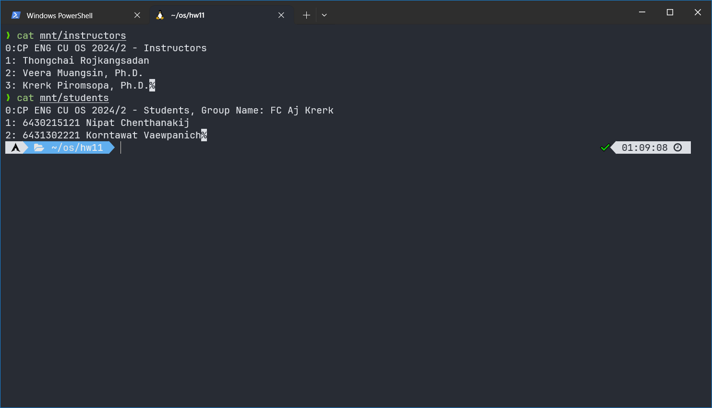
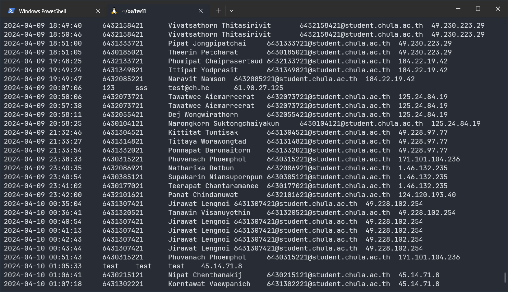

# Activity 11 - Filesystem Implementation

## Members

- Nipat Chenthanakij 6430215121
- Korntawat Vaewpanich 6431302221

## Questions

1. FUSE is a software interface for creating a filesystem in the user space without going into the kernel level. FUSE has many language bindings including Python, which provides ease of development and prototyping of a filesystem.
2. The filesystem used by the mounting point is fuseblk.
3. It is not possible to issue mkdir, copy, move or delete a file inside the mnt directory, since those functionalities must be implemented by the FUSE filesystem.

## Source Code

The code shown below is used for both checkpoint #1 and #2.

```py
#!/usr/bin/env python

# 2110352 Operating System
# FUSE/Filesystem exercise
# By Krerk Piromsopa, Ph.D. <Krerk.P@chula.ac.th>
#    Department of Computer Engineering
#    Chulalongkorn University.

import os, stat, errno
import fuse
from fuse import Fuse
import requests

if not hasattr(fuse, "__version__"):
    raise RuntimeError(
        "your fuse-py doesn't know of fuse.__version__, probably it's too old."
    )

fuse.fuse_python_api = (0, 2)

containers = {
    "/subject": b"2024/2 - Operating Systems\nCP ENG CU\n",
    "/instructors": b"""0:CP ENG CU OS 2024/2 - Instructors
1: Thongchai Rojkangsadan
2: Veera Muangsin, Ph.D.
3: Krerk Piromsopa, Ph.D.""",
    "/students": b"""0:CP ENG CU OS 2024/2 - Students, Group Name: FC Aj Krerk
1: 6430215121 Nipat Chenthanakij
2: 6431302221 Korntawat Vaewpanich""",
    "/participation": b"a",
}


class MyStat(fuse.Stat):
    def __init__(self):
        self.st_mode = 0
        self.st_ino = 0
        self.st_dev = 0
        self.st_nlink = 0
        self.st_uid = 0
        self.st_gid = 0
        self.st_size = 0
        self.st_atime = 0
        self.st_mtime = 0
        self.st_ctime = 0


class MyFS(Fuse):

    def __init__(self, *args, **kw):
        super(MyFS, self).__init__(*args, **kw)
        self.buffer = bytearray()

    def getattr(self, path):
        st = MyStat()
        if path == "/":
            st.st_mode = stat.S_IFDIR | 0o777
            st.st_nlink = 2
        elif path == "/participation":
            st.st_mode = stat.S_IFREG | 0o666
            st.st_nlink = 1
            res = requests.get(
                "https://mis.cp.eng.chula.ac.th/krerk/teaching/2022s2-os/status.php"
            )
            content = bytes(res.text, encoding="utf-8")
            st.st_size = len(content)
        elif path in containers:
            st.st_mode = stat.S_IFREG | 0o444
            st.st_nlink = 1
            content = containers[path]
            st.st_size = len(content)
        else:
            return -errno.ENOENT
        return st

    def readdir(self, path, offset):
        filenames = containers.keys()
        for r in ".", "..":
            yield fuse.Direntry(r)

        for r in filenames:
            yield fuse.Direntry(r[1:])

    def open(self, path, flags):
        if path not in containers:
            return -errno.ENOENT
        if path == "/participation":
            return 0
        accmode = os.O_RDONLY | os.O_WRONLY | os.O_RDWR
        if (flags & accmode) != os.O_RDONLY:
            return -errno.EACCES

    def read(self, path, size, offset):
        if path not in containers:
            return -errno.ENOENT

        content = containers[path]

        if path == "/participation":
            res = requests.get(
                "https://mis.cp.eng.chula.ac.th/krerk/teaching/2022s2-os/status.php"
            )
            content = bytes(res.text, encoding="utf-8")

        slen = len(content)
        if offset < slen:
            if offset + size > slen:
                size = slen - offset
            buf = content[offset : offset + size]
        else:
            buf = b""
        return buf

    def write(self, path, buf, offset):
        if path not in containers:
            return -errno.ENOENT

        if path != "/participation":
            return -errno.EACCES

        self.buffer[:offset] = buf
        return len(buf)

    def flush(self, path):
        if path == "/participation":
            data = self.buffer.decode().split(":")
            requests.post(
                "https://mis.cp.eng.chula.ac.th/krerk/teaching/2022s2-os/checkIn.php",
                data={"studentid": data[0], "name": data[1], "email": data[2]},
            )
            self.buffer = bytearray()
        return 0

    def release(self, path, flags):
        return 0


def main():
    usage = (
        """
MyFS mounting_point

"""
        + Fuse.fusage
    )
    server = MyFS(
        version="%prog " + fuse.__version__, usage=usage, dash_s_do="setsingle"
    )

    server.parse(errex=1)
    server.main()


if __name__ == "__main__":
    main()

```

## Checkpoint #1



## Checkpoint #2


