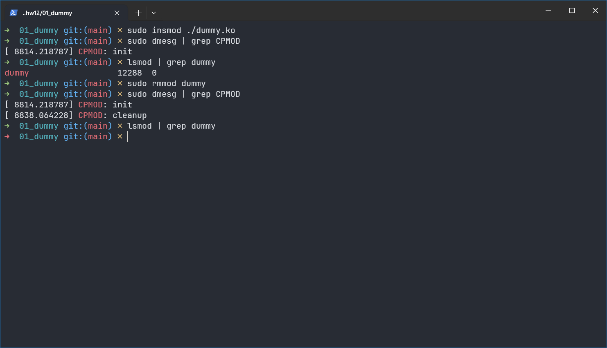
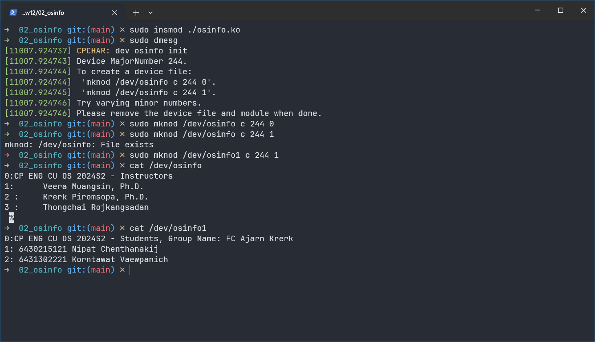
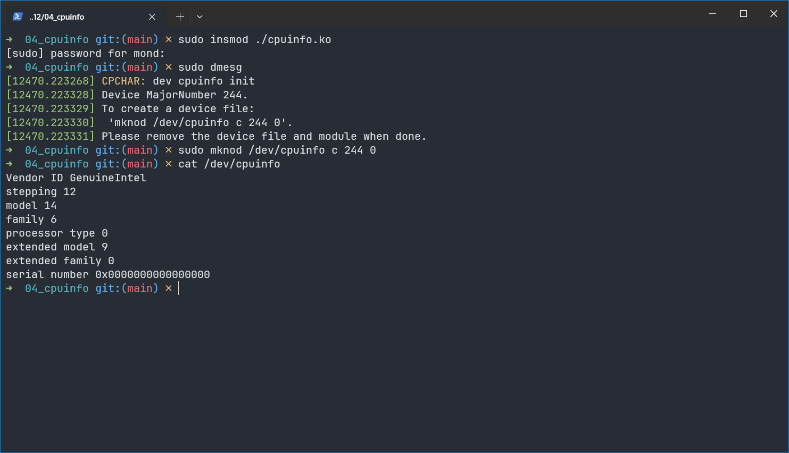
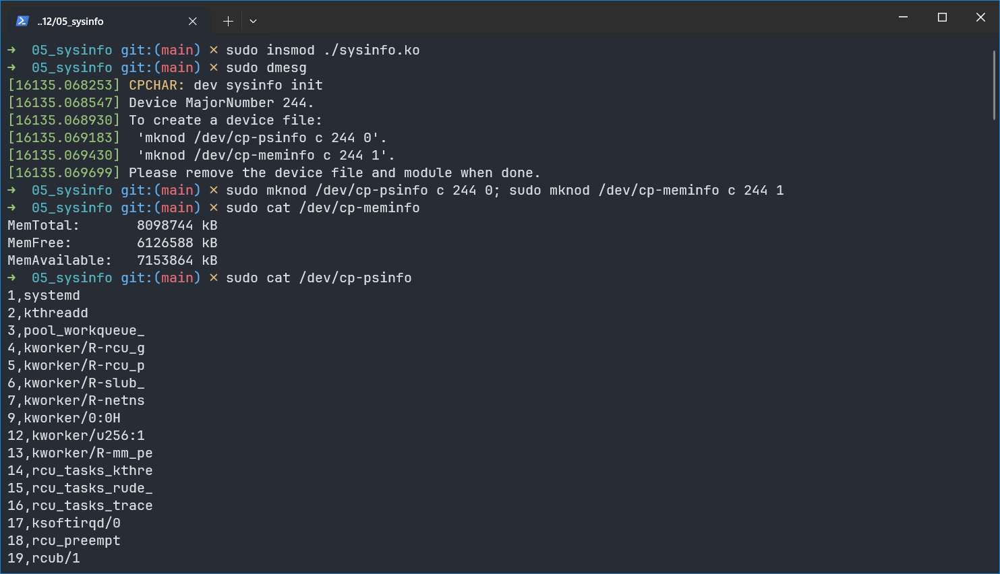

# Activity 12 - Kernel Module

## Members

- Nipat Chenthanakij 6430215121
- Korntawat Vaewpanich 6431302221

## Checkpoint 1



## Checkpoint 2 and 3



### Source Code

```c
// osinfo.c
#include <linux/module.h>
#include <linux/kernel.h>
#include <linux/fs.h>
#include <asm/uaccess.h>
/* Needed by all modules */
/* Needed for KERN_INFO */
MODULE_LICENSE("GPL");
MODULE_AUTHOR("KRERK PIROMSOPA, PH.D. <Krerk.P@chula.ac.th>");
MODULE_DESCRIPTION("\"osinfo\" Character Device");
#define DEVICENAME "osinfo"
static int dev_major;
static int dev_open = 0;
static char *f_ptr;
static const char f_data0[] = "0:CP ENG CU OS 2024S2 - Instructors\n1:\tVeera Muangsin, Ph.D.\n2 :\tKrerk Piromsopa, Ph.D.\n3 :\tThongchai Rojkangsadan\n ";
static const char f_data1[] = "0:CP ENG CU OS 2024S2 - Students, Group Name: FC Ajarn Krerk\n1: 6430215121 Nipat Chenthanakij\n2: 6431302221 Korntawat Vaewpanich\n";
// prototypes for device functions
static int device_open(struct inode *, struct file *);
static int device_release(struct inode *inode, struct file *file);
static ssize_t device_read(struct file *, char *, size_t, loff_t *);
// File operations structor
// Only implement those that will be used.
static struct file_operations dev_fops = {
    .read = device_read,
    .open = device_open,
    .release = device_release};
int init_module(void)
{
    printk(KERN_INFO "CPCHAR: dev osinfo init\n");
    dev_major = register_chrdev(0, DEVICENAME, &dev_fops);
    if (dev_major < 0)
    {
        printk(KERN_ALERT "Fail register_chrdev osinfo with %d\n", dev_major);
        return dev_major;
    }
    __register_chrdev(dev_major, 1, 1, "osinfo1", &dev_fops);
    printk(KERN_INFO "Device MajorNumber %d.\n", dev_major);
    printk(KERN_INFO "To create a device file:\n");
    printk(KERN_INFO "\t'mknod /dev/%s c %d 0'.\n", DEVICENAME, dev_major);
    printk(KERN_INFO "\t'mknod /dev/%s c %d 1'.\n", DEVICENAME, dev_major);
    printk(KERN_INFO "Try varying minor numbers.\n");
    printk(KERN_INFO "Please remove the device file and module when done.\n");
    /* * non 0 - means init_module failed */
    return 0;
}
void cleanup_module(void)
{
    printk(KERN_INFO "CPCHAR: dev osinfo cleanup\n");
    unregister_chrdev(dev_major, DEVICENAME);
    __unregister_chrdev(dev_major, 1, 1, "osinfo1");
}
static int device_open(struct inode *inode, struct file *file)
{
    if (dev_open)
        return -EBUSY;
    dev_open++;
    printk(KERN_INFO "dev minor %d\n", MINOR(inode->i_rdev));
    if (MINOR(inode->i_rdev) == 0)
        f_ptr = (char *)f_data0;
    else
        f_ptr = (char*)f_data1;
    // lock module
    try_module_get(THIS_MODULE);
    return 0;
}
static int device_release(struct inode *inode, struct file *file)
{
    dev_open--; /* We're now ready for our next caller */
    // release module
    module_put(THIS_MODULE);
    return 0;
}
static ssize_t device_read(struct file *filp,
                           char *buffer,
                           /* see include/linux/fs.h */
                           /* buffer to fill with data */
                           /* length of the buffer */
                           size_t length,
                           loff_t *offset)
{
    int bytes_read = 0;
    if (*f_ptr == 0)
    {
        return 0;
    }
    while (length && *f_ptr)
    {
        put_user(*(f_ptr++), buffer++);
        length--;
        bytes_read++;
    }
    return bytes_read;
}
```

## Checkpoint 4



### Source Code

```c
// osinfo.c
#include <linux/module.h>
#include <linux/kernel.h>
#include <linux/fs.h>
#include <asm/uaccess.h>
/* Needed by all modules */
/* Needed for KERN_INFO */
MODULE_LICENSE("GPL");
MODULE_AUTHOR("KRERK PIROMSOPA, PH.D. <Krerk.P@chula.ac.th>");
MODULE_DESCRIPTION("\"cpuinfo\" Character Device");
#define DEVICENAME "cpuinfo"
static int dev_major;
static int dev_open = 0;
static char buf[1024];
static char *f_ptr;
// prototypes for device functions
static int device_open(struct inode *, struct file *);
static int device_release(struct inode *inode, struct file *file);
static ssize_t device_read(struct file *, char *, size_t, loff_t *);
// File operations structor
// Only implement those that will be used.
static struct file_operations dev_fops = {
    .read = device_read,
    .open = device_open,
    .release = device_release};

static void _native_cpuid(unsigned int *eax, unsigned int *ebx,
                                unsigned int *ecx, unsigned int *edx)
{
    /* ecx is often an input as well as an output. */
    asm volatile("cpuid"
                 : "=a"(*eax),
                   "=b"(*ebx),
                   "=c"(*ecx),
                   "=d"(*edx)
                 : "0"(*eax), "2"(*ecx)
                 : "memory");
}

static void get_cpuid(void)
{
    // Code snippet
    unsigned eax, ebx, ecx, edx;
    // for obtaining the features
    eax = 0; /* processor info and feature bits */
    _native_cpuid(&eax, &ebx, &ecx, &edx);
    char buf1[256], buf2[256], buf3[256];
    snprintf(buf1, 256, "Vendor ID %c%c%c%c%c%c%c%c%c%c%c%c\n",
             (ebx) & 0xFF, (ebx >> 8) & 0xFF, (ebx >> 16) & 0xFF, (ebx >> 24) & 0xFF,
             (edx) & 0xFF, (edx >> 8) & 0xFF, (edx >> 16) & 0xFF, (edx >> 24) & 0xFF,
             (ecx) & 0xFF, (ecx >> 8) & 0xFF, (ecx >> 16) & 0xFF, (ecx >> 24) & 0xFF);
    // for obtaining the features
    eax = 1; /* processor info and feature bits */
    _native_cpuid(&eax, &ebx, &ecx, &edx);
    snprintf(buf2, 256, "stepping %d\nmodel %d\nfamily %d\nprocessor type %d\nextended model %d\nextended family %d\n",
             eax & 0xF,
             (eax >> 4) & 0xF,
             (eax >> 8) & 0xF,
             (eax >> 12) & 0x3,
             (eax >> 16) & 0xF,
             (eax >> 20) & 0xFF);
    // for obtaining the serial number
    eax = 3; /* processor serial number */
    _native_cpuid(&eax, &ebx, &ecx, &edx);
    snprintf(buf3, 256, "serial number 0x%08x%08x\n", edx, ecx);
    strncat(buf, buf1, 1024);
    strncat(buf, buf2, 1024);
    strncat(buf, buf3, 1024);
}

int init_module(void)
{
    printk(KERN_INFO "CPCHAR: dev cpuinfo init\n");
    dev_major = register_chrdev(0, DEVICENAME, &dev_fops);
    if (dev_major < 0)
    {
        printk(KERN_ALERT "Fail register_chrdev cpuinfo with %d\n", dev_major);
        return dev_major;
    }
    get_cpuid();
    printk(KERN_INFO "Device MajorNumber %d.\n", dev_major);
    printk(KERN_INFO "To create a device file:\n");
    printk(KERN_INFO "\t'mknod /dev/%s c %d 0'.\n", DEVICENAME, dev_major);
    printk(KERN_INFO "Please remove the device file and module when done.\n");
    /* * non 0 - means init_module failed */
    return 0;
}
void cleanup_module(void)
{
    printk(KERN_INFO "CPCHAR: dev cpuinfo cleanup\n");
    unregister_chrdev(dev_major, DEVICENAME);
}
static int device_open(struct inode *inode, struct file *file)
{
    if (dev_open)
        return -EBUSY;
    dev_open++;
    printk(KERN_INFO "dev minor %d\n", MINOR(inode->i_rdev));
    f_ptr = (char *)buf;
    // lock module
    try_module_get(THIS_MODULE);
    return 0;
}
static int device_release(struct inode *inode, struct file *file)
{
    dev_open--; /* We're now ready for our next caller */
    // release module
    module_put(THIS_MODULE);
    return 0;
}
static ssize_t device_read(struct file *filp,
                           char *buffer,
                           /* see include/linux/fs.h */
                           /* buffer to fill with data */
                           /* length of the buffer */
                           size_t length,
                           loff_t *offset)
{
    int bytes_read = 0;
    if (*f_ptr == 0)
    {
        return 0;
    }
    while (length && *f_ptr)
    {
        put_user(*(f_ptr++), buffer++);
        length--;
        bytes_read++;
    }
    return bytes_read;
}
```

## Checkpoint 5 and 6



### Source

```c
// osinfo.c
#include <linux/module.h>
#include <linux/kernel.h>
#include <linux/fs.h>
#include <asm/uaccess.h>
#include <linux/sched.h>
#include <linux/mm.h>
/* Needed by all modules */
/* Needed for KERN_INFO */
MODULE_LICENSE("GPL");
MODULE_AUTHOR("KRERK PIROMSOPA, PH.D. <Krerk.P@chula.ac.th>");
MODULE_DESCRIPTION("\"sysinfo\" Character Device");
#define DEVICENAME0 "cp-psinfo"
#define DEVICENAME1 "cp-meminfo"
static int dev_major;
static int dev_open = 0;
static char *f_ptr;
static char buf0[4096], buf1[1024];
// prototypes for device functions
static int device_open(struct inode *, struct file *);
static int device_release(struct inode *inode, struct file *file);
static ssize_t device_read(struct file *, char *, size_t, loff_t *);
// File operations structor
// Only implement those that will be used.
static struct file_operations dev_fops = {
    .read = device_read,
    .open = device_open,
    .release = device_release};

static void populate_processes(void)
{
    buf0[0] = 0;
    struct task_struct *task;
    for_each_process(task)
    {
        char tmp[64];
        snprintf(tmp, 64, "%d,%s\n", task->pid, task->comm);
        strncat(buf0, tmp, 1024);
    }
}

#define TO_BYTES(x) (x >> 10)

static void get_memory_info(void)
{
    struct sysinfo si;
    si_meminfo(&si);
    long available = si_mem_available();
    snprintf(buf1, 1024, "MemTotal:       %lu kB\nMemFree:        %lu kB\nMemAvailable:   %ld kB\n",
             si.totalram * si.mem_unit / 1024, si.freeram * si.mem_unit / 1024, available * si.mem_unit / 1024);
}

int init_module(void)
{
    printk(KERN_INFO "CPCHAR: dev sysinfo init\n");
    dev_major = register_chrdev(0, DEVICENAME0, &dev_fops);
    __register_chrdev(dev_major, 1, 1, DEVICENAME1, &dev_fops);
    printk(KERN_INFO "Device MajorNumber %d.\n", dev_major);
    printk(KERN_INFO "To create a device file:\n");
    printk(KERN_INFO "\t'mknod /dev/%s c %d 0'.\n", DEVICENAME0, dev_major);
    printk(KERN_INFO "\t'mknod /dev/%s c %d 1'.\n", DEVICENAME1, dev_major);
    printk(KERN_INFO "Please remove the device file and module when done.\n");
    /* * non 0 - means init_module failed */
    return 0;
}
void cleanup_module(void)
{
    printk(KERN_INFO "CPCHAR: dev sysinfo cleanup\n");
    unregister_chrdev(dev_major, DEVICENAME0);
    __unregister_chrdev(dev_major, 1, 1, DEVICENAME1);
}
static int device_open(struct inode *inode, struct file *file)
{
    if (dev_open)
        return -EBUSY;
    dev_open++;
    printk(KERN_INFO "dev minor %d\n", MINOR(inode->i_rdev));
    if (MINOR(inode->i_rdev) == 0)
    {
        populate_processes();
        f_ptr = (char *)buf0;
    }
    else if (MINOR(inode->i_rdev) == 1)
    {
        get_memory_info();
        f_ptr = (char *)buf1;
    }
    // lock module
    try_module_get(THIS_MODULE);
    return 0;
}
static int device_release(struct inode *inode, struct file *file)
{
    dev_open--; /* We're now ready for our next caller */
    // release module
    module_put(THIS_MODULE);
    return 0;
}
static ssize_t device_read(struct file *filp,
                           char *buffer,
                           /* see include/linux/fs.h */
                           /* buffer to fill with data */
                           /* length of the buffer */
                           size_t length,
                           loff_t *offset)
{
    int bytes_read = 0;
    if (*f_ptr == 0)
    {
        return 0;
    }
    while (length && *f_ptr)
    {
        put_user(*(f_ptr++), buffer++);
        length--;
        bytes_read++;
    }
    return bytes_read;
}
```