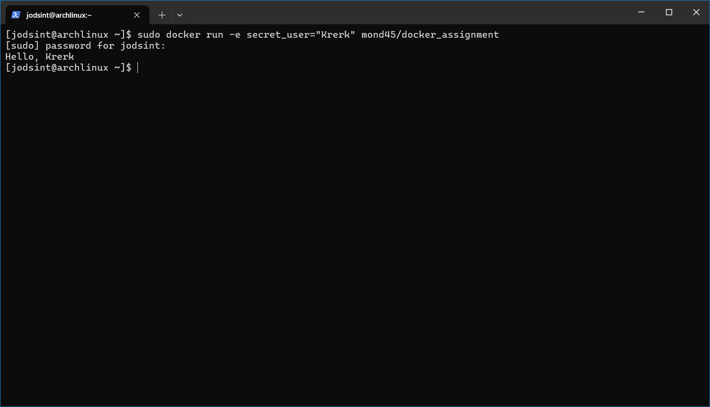

# Activity 13 - Docker

## Members

- Nipat Chenthanakij 6430215121
- Korntawat Vaewpanich 6431302221

## Image Creation

### Python Script

```py
# main.py

import os

print(f'Hello, {os.environ['secret_user']}')
```

### Dockerfile

```Dockerfile
FROM python:3

WORKDIR /usr/src/app

COPY . .

CMD ["python", "./main.py"]
```

The image is built using the command `docker build -t docker_assignment .`

The image is then pushed to Docker Hub using the command:

```shell
docker tag docker_assignment:latest mond45/docker_assignment:latest
docker push mond45/docker_assignment:latest
```

## Container Usage


The image is run on the other machine using the command `sudo docker run -e secret_user="Krerk" mond45/docker_assignment`
