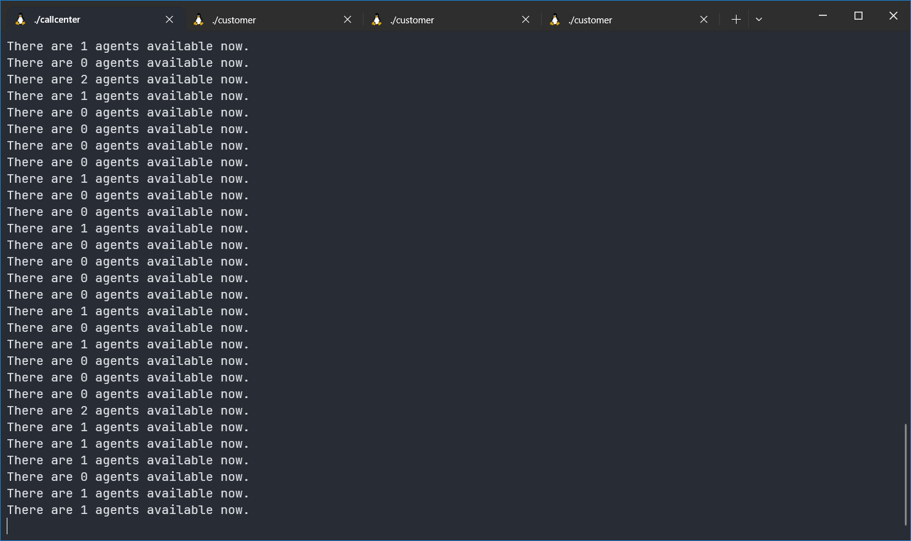
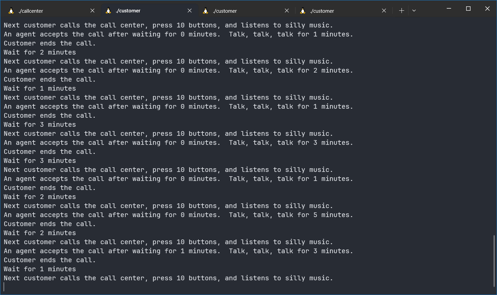

# Activity 7 - Process Syncronization

## Members

- Nipat Chenthanakij 6430215121
- Korntawat Vaewpanich 6431302221

```c++
// callcenter.c
#include <stdio.h>
#include <stdlib.h>
#include <unistd.h>
#include <fcntl.h>
#include <semaphore.h>

int main(int argc, char **argv)
{
	int num_agents = 2;
	if (argc > 1)
		num_agents = atoi(argv[1]);
	printf("Starting a call center with %d agents.\n", num_agents);

	//
	// OS -- CRAETE NAMED SEMAPHORE HERE
	//
	sem_t *sem = sem_open("callcenter", O_CREAT, 0644, num_agents);

	int semval;
	while (1)
	{

		//
		// OS -- PLACE CURRENT VALUE OF SEMAPHORE IN 'semval' HERE
		//
		sem_getvalue(sem, &semval);

		printf("There are %d agents available now.\n", semval);
		sleep(3);
	}
}

```

```c++
// customer.c
#include <stdio.h>
#include <stdlib.h>
#include <unistd.h>
#include <fcntl.h>
#include <time.h>
#include <semaphore.h>

int rand_int(int n)
{
	// Generate random integer number between [1, n]
	int r = rand();
	return (r % n) + 1;
}

int main(int argc, char **argv)
{
	printf("Starting customer\n");

	//
	// OS -- OPEN NAMED SEMAPHORE HERE
	//
	sem_t *sem = sem_open("callcenter", 0);

	while (1)
	{
		// Customer will wait between 1-3 seconds before placing the next phone call
		int wait_time = rand_int(3);
		printf("Wait for %d minutes\n", wait_time);
		sleep(wait_time);
		printf("Next customer calls the call center, press 10 buttons, and listens to silly music.\n");
		time_t t0 = time(NULL);
		// Wait for an agent

		//
		// OS -- LOCK SEMAPHORE HERE
		//
		sem_wait(sem);

		time_t t = time(NULL) - t0;
		// An agent accepts the call, using it for 1-5 seconds.
		int call_time = rand_int(5);
		printf("An agent accepts the call after waiting for %ld minutes.  Talk, talk, talk for %d minutes.\n", t, call_time);
		sleep(call_time);
		// Customer hangs up the phone

		//
		// OS -- UNLOCK SEMAPHORE HERE
		//
		sem_post(sem);

		printf("Customer ends the call.\n");
	}
}
```

## Screenshots



