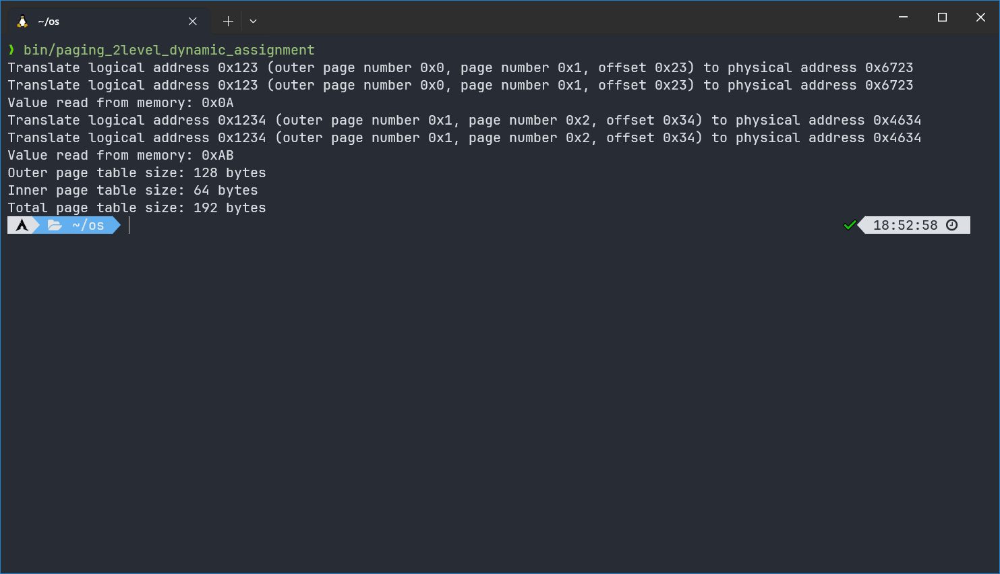

# Activity 8 - Memory Management

## Members

- Nipat Chenthanakij 6430215121
- Korntawat Vaewpanich 6431302221

## Modified Code

```c
#include <stdio.h>
#include <stdlib.h>
#include <stdint.h>

#define FRAME_SIZE 256
#define FRAME_ENTRIES 128
#define PAGE_SIZE 256
#define PAGE_ENTRIES 16
#define OUTER_PAGE_ENTRIES 16

typedef struct PageTableEntry
{
    uint16_t present : 1;
    uint16_t frame : 15;
} PageTableEntry;

PageTableEntry *page_table;
PageTableEntry *outer_page_table[OUTER_PAGE_ENTRIES];

uint8_t *physical_memory;

uint16_t translate_address(uint16_t logical_address)
{
    // 4 4 8
    // Assignment: complete following statements that get outer page number and page number from logical address
    uint8_t outer_page_number = logical_address >> 12;
    uint8_t page_number = (logical_address >> 8) & 0xF;

    // Assignment: complete following statements that allocate inner page table
    if (outer_page_table[outer_page_number] == NULL)
    {
        // Inner page table not present, allocate an inner page table for it
        outer_page_table[outer_page_number] = calloc(PAGE_ENTRIES, sizeof(PageTableEntry));
    }

    if (outer_page_table[outer_page_number][page_number].present == 0)
    {
        // Page not present, allocate a frame for it
        // For simplicity, just random a frame. Must fix this later.
        uint16_t frame_number = rand() % FRAME_ENTRIES;

        // Assignment: complete following statements that fill in page table
        outer_page_table[outer_page_number][page_number].present = 1;
        outer_page_table[outer_page_number][page_number].frame = frame_number;
    }

    // Assignment: complete following statement that constructs physical address from frame number and offset
    uint16_t physical_address = (outer_page_table[outer_page_number][page_number].frame << 8)
                              + (logical_address & 0xFF);

    printf("Translate logical address 0x%X (outer page number 0x%X, page number 0x%X, offset 0x%X) to physical address 0x%X\n",
           logical_address, outer_page_number, page_number, logical_address & 0xFF, physical_address);

    return physical_address;
}

void read_from_memory(uint16_t logical_address, uint8_t *value)
{
    uint16_t physical_address = translate_address(logical_address);
    *value = physical_memory[physical_address];
}

void write_to_memory(uint16_t logical_address, uint8_t value)
{
    uint16_t physical_address = translate_address(logical_address);
    physical_memory[physical_address] = value;
}

int main()
{
    // Allocate physical memory
    physical_memory = calloc(PAGE_ENTRIES, PAGE_SIZE);

    // Read and write to memory
    uint8_t value;
    write_to_memory(0x123, 0xA);
    read_from_memory(0x123, &value);
    printf("Value read from memory: 0x%02X\n", value);
    write_to_memory(0x1234, 0xAB);
    read_from_memory(0x1234, &value);
    printf("Value read from memory: 0x%02X\n", value);

    // Calculate total size of outer page table and inner page tables
    size_t page_table_size = 0;
    for (int i = 0; i < OUTER_PAGE_ENTRIES; i++)
    {
        if (outer_page_table[i] != NULL)
        {
            page_table_size += PAGE_ENTRIES * sizeof(PageTableEntry);
        }
    }

    printf("Outer page table size: %zu bytes\n", sizeof(outer_page_table));
    printf("Inner page table size: %zu bytes\n", page_table_size);
    printf("Total page table size: %zu bytes\n", sizeof(outer_page_table) + page_table_size);

    return (0);
}
```

## Screenshot


