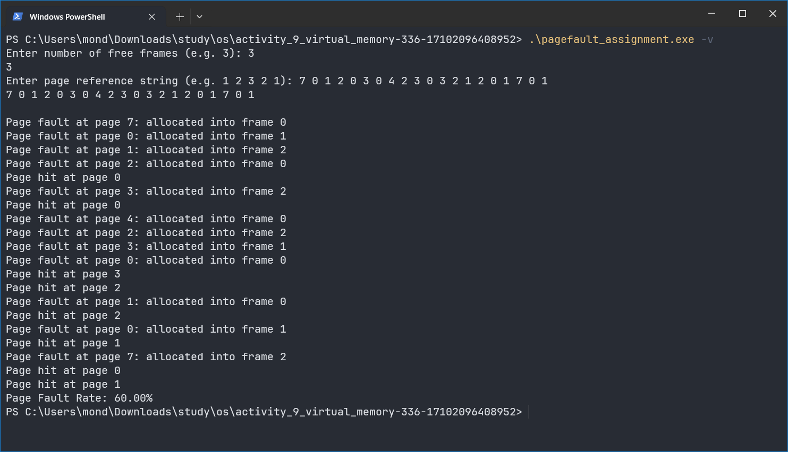

# Activity 8 - Memory Management

## Members

- Nipat Chenthanakij 6430215121
- Korntawat Vaewpanich 6431302221

## Modified Code
```c
// A program to simulates page faults and calculates page fault rate.
// Input: a list of page references (a series of page numbers, separated by a space).
// Output: page fault rate
// Option: -v   --> verbose mode: print the result of every page reference,
//              whether a page fault occurs, the involved page table entry, page number, and frame number.

#include <stdio.h>
#include <stdlib.h>
#include <stdint.h>
#include <string.h>

#define PAGE_TABLE_SIZE 128
#define MAX_FRAMES 128

typedef struct PageTableEntry
{
    uint16_t valid : 1;
    uint16_t frame : 15;
} PageTableEntry;

typedef struct FrameEntry
{
    int page_number;
    int timestamp;
} FrameEntry;

PageTableEntry page_table[PAGE_TABLE_SIZE];
FrameEntry frames[MAX_FRAMES];
int num_frames, num_free_frames;

int get_free_frame(int page_number, int timestamp)
{
    if (num_free_frames > 0)
    {
        // Get the first free frame
        for (int i = 0; i < num_frames; i++)
        {
            if (frames[i].page_number == -1)
            {
                // Assignment 1.1
                // Update page number and timestamp of the free frame
                frames[i].page_number = page_number;
                frames[i].timestamp = timestamp;
                num_free_frames--;
                return i;
            }
        }
    }
    // If no free frame, select one of occupied frames, using FIFO alorithm.
    else
    {
        int oldest_frame = 0;
        int min_timestamp = frames[0].timestamp;

        // Assignment 1.2
        // Find the oldest frame that is to be replaced
        for (int i = 1; i < num_frames; i++)
        {
            if (frames[i].timestamp < min_timestamp)
            {
                oldest_frame = i;
                min_timestamp = frames[i].timestamp;
            }
        }
        // Assignment 1.3
        // invalidate the replaced page in the page table (valid=0)
        page_table[frames[oldest_frame].page_number].valid = 0;
        // Assignment 1.4
        // assign page number and timestamp to the selected frame (frames[oldest_frame])
        frames[oldest_frame].page_number = page_number;
        frames[oldest_frame].timestamp = timestamp;
        return oldest_frame;
    }
}

int main(int argc, char *argv[])
{
    char buf[5];
    int page_faults = 0, page_references = 0;
    char page_reference_string[1024];
    int verbose = 0;

    // Parse command line arguments
    if (argc > 1 && strcmp(argv[1], "-v") == 0)
    {
        verbose = 1;
    }

    // Read in number of free frame
    printf("Enter number of free frames (e.g. 3): ");
    fgets(buf, sizeof(buf), stdin);
    num_frames = atoi(buf);
    printf("%d\n", num_frames);

    // Initialize frame list. page_number = -1 = free
    num_free_frames = num_frames;
    for (int i = 0; i < num_frames; i++)
    {
        frames[i].page_number = -1;
    }

    // Read in page reference string
    printf("Enter page reference string (e.g. 1 2 3 2 1): ");
    fgets(page_reference_string, sizeof(page_reference_string), stdin);
    printf("%s\n", page_reference_string);

    // Initialize page table
    for (int i = 0; i < PAGE_TABLE_SIZE; i++)
    {
        page_table[i].valid = 0;
        page_table[i].frame = 0;
        ;
    }

    // Parse page reference string and simulate paging
    char *token = strtok(page_reference_string, " ");
    while (token != NULL)
    {
        int page_number = atoi(token);
        int frame_number;
        page_references++;

        // If page is not in memory, page fault occurs, try to get a free frame.
        if (page_table[page_number].valid == 0)
        {
            page_faults++;
            frame_number = get_free_frame(page_number, page_references); // use page_references as timestamp
            if (frame_number != -1)
            {
                page_table[page_number].valid = 1;
                page_table[page_number].frame = frame_number;
                if (verbose)
                    printf("Page fault at page %d: allocated into frame %d\n", page_number, frame_number);
            }
            else
            {
                if (verbose)
                    printf("Page fault at page %d: No Free Frame!\n", page_number);
            }
        }
        else
        {
            // Assignment 2
            // Update timestamp of the referenced page in the frames list
            frames[page_table[page_number].frame].timestamp = page_references;
            if (verbose)
                printf("Page hit at page %d\n", page_number);
        }
        token = strtok(NULL, " ");
    }

    // Calculate page fault rate
    float page_fault_rate = (float)page_faults / page_references * 100;
    printf("Page Fault Rate: %.2f%%\n", page_fault_rate);

    return 0;
}
```

## Screenshot

